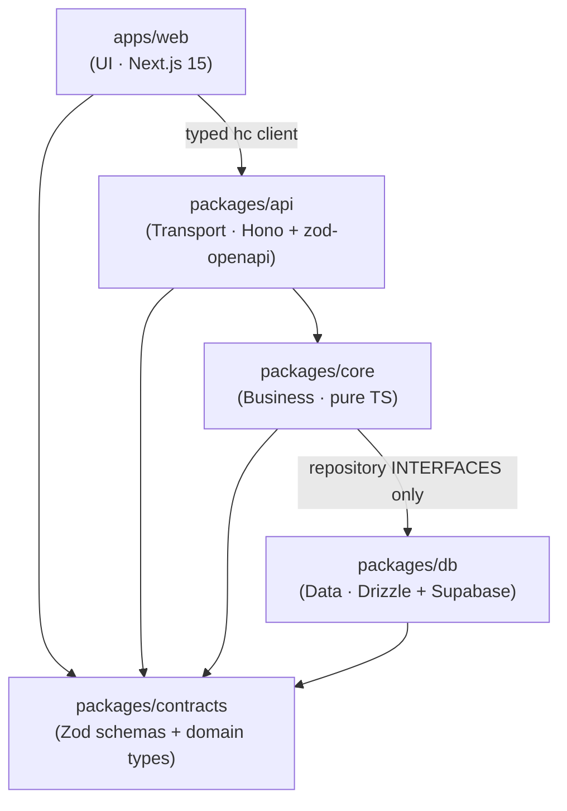

# LifeOS

A production-grade, PWA life-management app built as a **Turborepo + pnpm** monorepo.
Deploys to **Vercel**, backed by **Supabase** (Postgres, Auth, Storage, Realtime).

The whole point of this repo is **strict, enforced layer separation**. Read this
before adding code.

## Architecture: four layers, one-way dependencies



### The rules (enforced, not just documented)

| Layer                 | May import                                             | Must NOT import                          |
| --------------------- | ------------------------------------------------------ | ---------------------------------------- |
| `apps/web` (UI)       | `@lifeos/api` (client), `@lifeos/contracts`            | `core`, `db`, `drizzle-orm`, `@supabase/*` |
| `packages/api`        | `@lifeos/core`, `@lifeos/contracts`                    | `db`, `drizzle-orm`, `@supabase/*`       |
| `packages/core`       | `@lifeos/contracts` (+ `db` **interfaces via types**)  | React, Next, Hono, Supabase, drizzle-orm |
| `packages/db`         | `@lifeos/contracts`                                     | `core`, `api`, `web`                     |
| `packages/contracts`  | _(nothing)_                                            | everything else                          |

Additional hard rules:

- **Only `packages/db`** may import `drizzle-orm`, `postgres`, or `@supabase/*`.
- **`packages/core` is framework-free** — pure TypeScript + Zod. No React/Next/Hono/Supabase.
- `core` defines repository **interfaces** (`TaskRepository`); `db` provides a
  **structural** implementation (`DrizzleTaskRepository`) that never imports `core`;
  the two are wired at the **composition root** (`apps/web/server/composition.ts`)
  via `satisfies AppDeps` — that is where dependency inversion is type-checked.

### How enforcement works

1. **`eslint-plugin-boundaries`** (root `.eslintrc.cjs`) maps every folder to a
   layer and only allows the arrows above. The web app is split into two element
   types: `web` (UI — may only reach `api`/`contracts`) and `web-infra`
   (composition root + auth plumbing — may wire `db`).
2. **`no-restricted-imports`** bans `drizzle-orm`/`postgres`/`@supabase/*` in every
   layer except `db`, and bans all frameworks in `core`.
3. **`package.json`** in each package declares only its allowed workspace deps.

Try it: add `import "drizzle-orm";` to any file under `apps/web` or `packages/core`
and run `pnpm lint` — it fails.

## Layer stacks

- **`apps/web`** — Next.js 15 App Router, Tailwind + shadcn/ui, TanStack Query v5,
  React Hook Form + Zod resolvers (schemas from `contracts`), Zustand (ephemeral UI
  state only), Serwist PWA (installable, offline app shell). Components call typed
  API hooks only — no business logic, no data access.
- **`packages/api`** — Hono + `@hono/zod-openapi`. Each route: validate (Zod) → call a
  `core` service → map to a response schema. Versioned under `/api/v1`. OpenAPI doc at
  `/api/v1/openapi.json`, Scalar docs at `/api/v1/docs`. Exports a typed `hc` client.
- **`packages/core`** — Service modules (`taskService`) receiving `{ userId, repos }`,
  applying business rules, returning `contracts` domain types. Ships an in-memory fake
  repository for tests.
- **`packages/db`** — Drizzle schema + committed `drizzle-kit` migrations, repositories
  that map snake_case rows to camelCase domain types, and `@supabase/ssr` clients used
  ONLY for auth, storage signed URLs, and realtime.

## Getting started

```bash
pnpm install
cp .env.example .env            # fill in values
```

### Run against local Supabase

```bash
supabase start                  # starts Postgres, Auth, Studio locally
# copy the printed anon/service keys + pooler URL into .env
pnpm db:migrate                 # apply Drizzle migrations (tables + RLS)
pnpm dev                        # http://localhost:3000
```

`DATABASE_URL` **must** use the Supabase **Supavisor transaction pooler (port 6543)** —
required for serverless/Vercel. See `.env.example`.

## Common commands

| Command            | What it does                                            |
| ------------------ | ------------------------------------------------------- |
| `pnpm dev`         | Run the web app (Turbo)                                 |
| `pnpm build`       | Build everything                                        |
| `pnpm lint`        | ESLint incl. **layer boundaries**                       |
| `pnpm typecheck`   | `tsc --noEmit` across the workspace                     |
| `pnpm test`        | Vitest unit tests (**no database required**)            |
| `pnpm test:e2e`    | Playwright happy-path E2E (needs `supabase start`)      |
| `pnpm db:generate` | Generate a new Drizzle migration from the schema        |
| `pnpm db:migrate`  | Apply migrations                                        |

## How to add a feature (copy the Tasks slice)

The `tasks` feature is the reference pattern. To add, say, `notes`:

1. **`contracts`** — add the domain type + Zod schemas (`create*Input`, `*Response`)
   in `packages/contracts/src/<feature>.ts` and export them.
2. **`db`** — add the Drizzle table in `packages/db/src/schema/<feature>.ts`, run
   `pnpm db:generate`, add the RLS policy migration, and write a
   `Drizzle<Feature>Repository` that maps rows → `contracts` types.
3. **`core`** — add the `<Feature>Repository` **interface** in `src/ports/`, add it to
   `Repositories`, and write `<feature>Service` with your business rules. Add unit tests
   with the in-memory fake.
4. **`api`** — add `createRoute` definitions in `src/routes/<feature>.ts` (with error
   responses) and chain `.openapi(...)` handlers in `src/app.ts`.
5. **`web`** — add TanStack Query hooks in `lib/hooks/`, wire the concrete repository in
   `server/composition.ts`, and build the page/components using the typed `hc` client.

Never let a Drizzle/Supabase type leak above `db`, and never put business logic in a
route or a component.

## Auth & security

- Supabase Auth with cookies via `@supabase/ssr`; `middleware.ts` refreshes sessions.
- The Hono app extracts the verified `userId` and passes it into services.
- Every table has **RLS** policies (`(select auth.uid()) = user_id`) as
  defense-in-depth — services remain the primary authorization boundary.
- `SUPABASE_SERVICE_ROLE_KEY` is server-only and never prefixed with `NEXT_PUBLIC_`.
